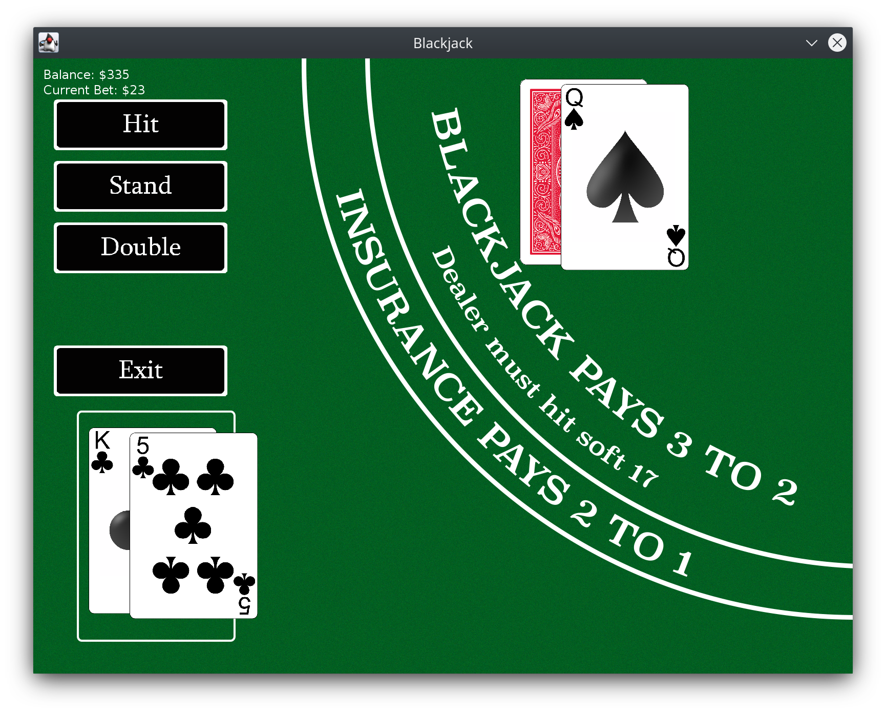

# blackjack
A simple blackjack game in Java/Graphics2D.<br>
Compile with 
```bash
javac @Sources.txt
```
Then, make it an executable JAR file with 
```bash
jar -cfm Blackjack.jar Manifest.txt *.class img cards
```
Or, you can download the executable JAR file <a href="https://mega.nz/#!NRskmZpL!EWvPFLckRaWAc6DpleuIzHXnHea09w2mPbWT4Gl0l6A">here</a>.


